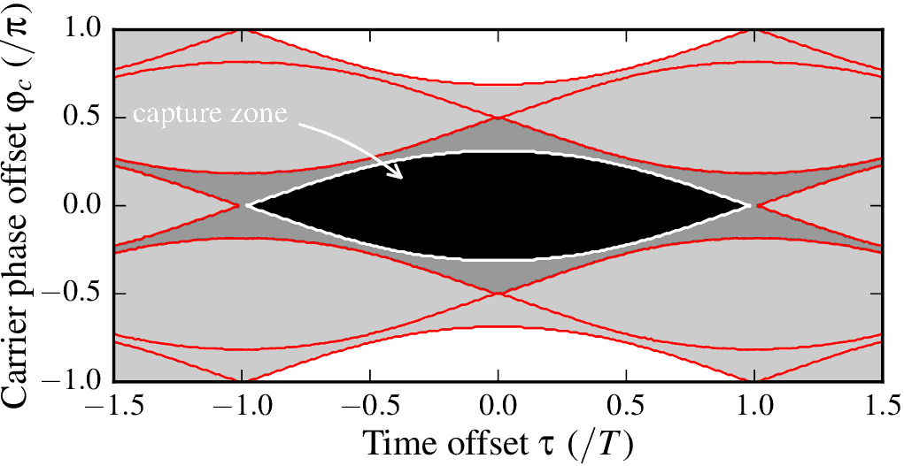
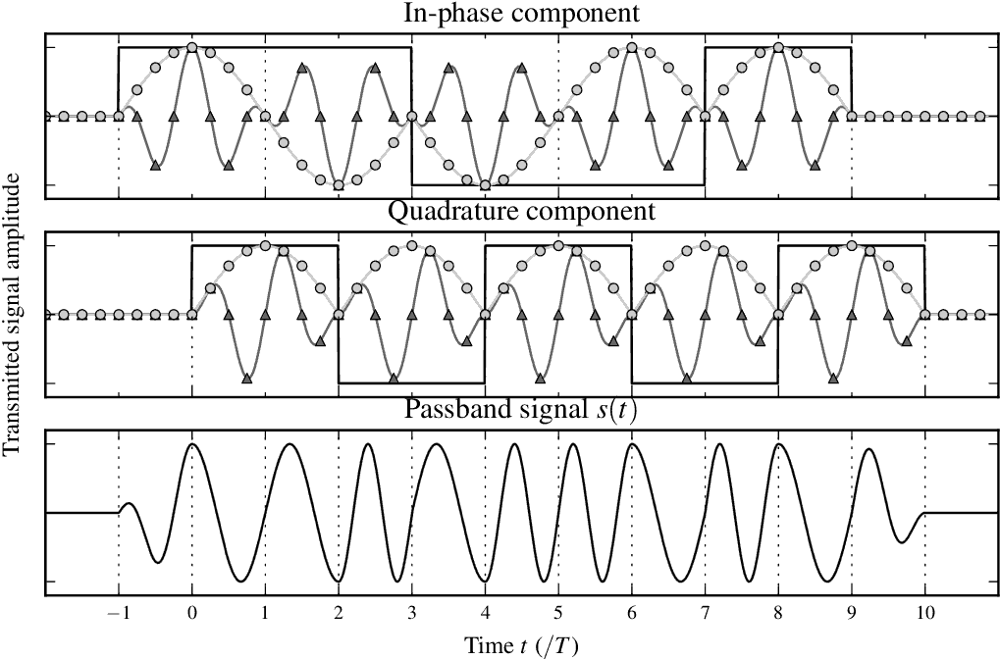

Packet Collisions in 802.15.4 Networks
=========

Simulation code for the analysis of concurrent transmission in IEEE 802.15.4 wireless networks. 
This is the accompanying code to the technical report available at [ArXiv](http://arxiv.org/abs/1309.4978); the full paper appeared in IEEE Transactions on Wireless Communications 13(12) ([On the Reception of Concurrent Transmissions in Wireless Sensor Networks](http://dx.doi.org/10.1109/TWC.2014.2349896)).

## Directories
- `src`: Python code for calculating the demodulator output of the receiver
- `julia`: re-implementation in Julia using `@parallel`, awesomely faster
- `figs`: matplotlib code used to generate some of the figures in the paper, to see how to use phitau.py
- `collision-viz`: re-implementation of the simulation code in JavaScript and the visualization applet code

### Dependencies
#### Python
For the `src`/`figs` part, you need
- numpy/scipy
- matplotlib installation that supports TeX output (see the [matplotlib help page](http://matplotlib.org/users/usetex.html))

#### Julia
For `julia`, you need 
- the release version (v0.5) of Julia
- package `NPZ` (to read and write numpy data files)
- `PyPlot` (to call matplotlib from julia)
- `DistributedArrays` (for speed up by parallel computations)

Run it like this to enable parallel execution on worker threads (inside the subfolders in the `figs` folder):

`$ julia -O 3 -p auto gen_ser_contour.jl unif soft`

### Example Outputs
#### BER Contour Plot
Plot of the bit error rate that a sender experiences when time or phase offsets are present.

#### MSK Waveform Plot
An example waveform of the physical signal when the sender employs the minimum shift keying modulation.

